# hse_hw2_chip

[Google Colab](https://colab.research.google.com/drive/1GvCXH6ofLRC60cPrz8tkaT0D80Hoz5yo?usp=sharing)

Для исследования была выбрана клеточная линия H1 и гистоновая метка H3K4me2.

## Анализ FastQC

HTML-выдача FastQC лежит в data

1-ая ChipSeq реплика | 2-ая ChipSeq реплика | Контроль
--- | --- | ---
[ENCFF181QBV](https://github.com/ED-Daniel/hse_hw2_chip/blob/main/FastQC/ENCFF181QBV_fastqc/fastqc_report.html) | [ENCFF388MXW](https://github.com/ED-Daniel/hse_hw2_chip/blob/main/FastQC/ENCFF388MXW_fastqc/fastqc_report.html) | [ENCFF176RJQ](https://github.com/ED-Daniel/hse_hw2_chip/blob/main/FastQC/ENCFF176RJQ_fastqc/fastqc_report.html)

### FastQC

ENCFF181QBV | ENCFF388MXW | ENCFF176RJQ
--- | --- | ---
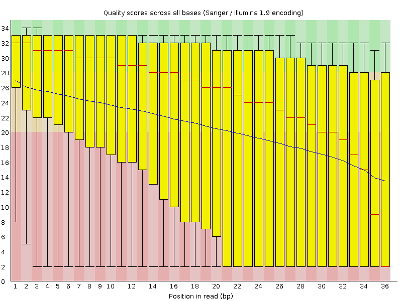 | 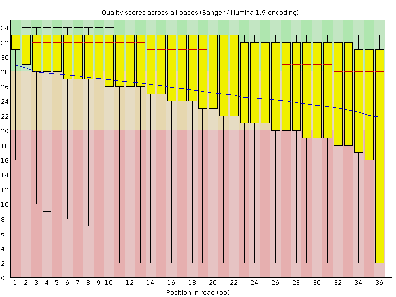 | 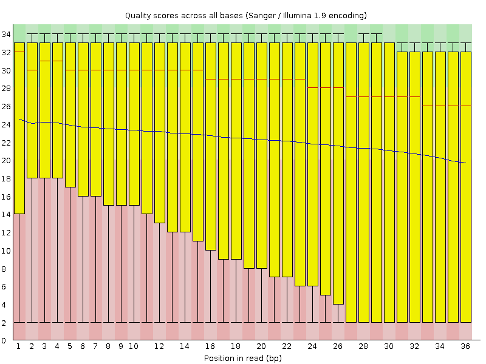
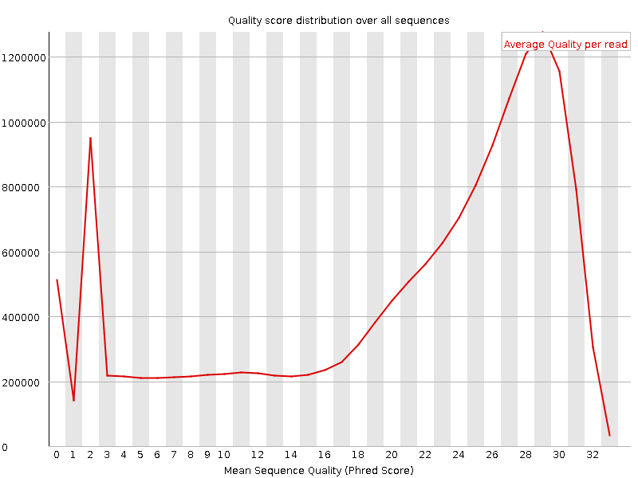 | 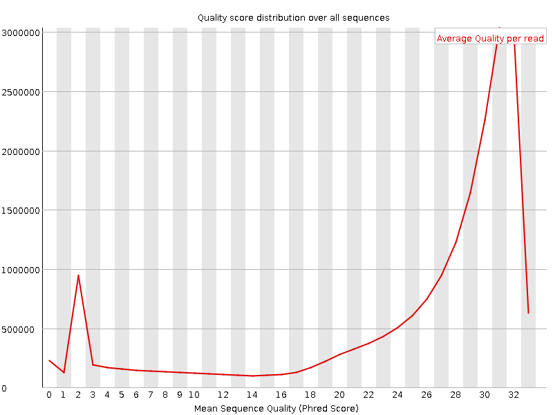 | 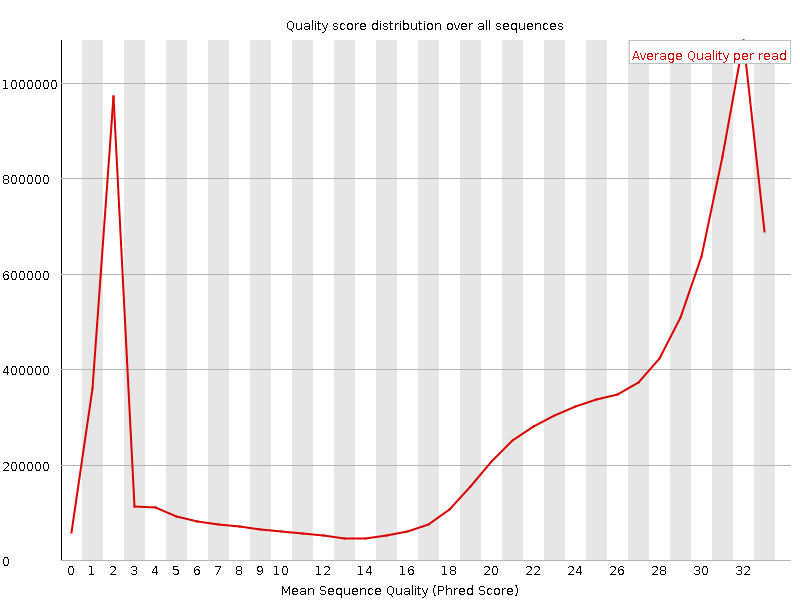
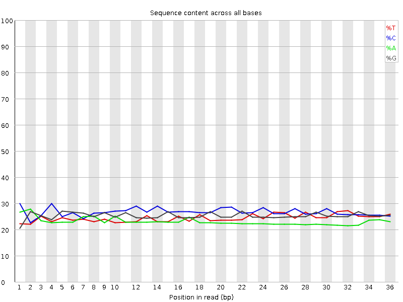 | 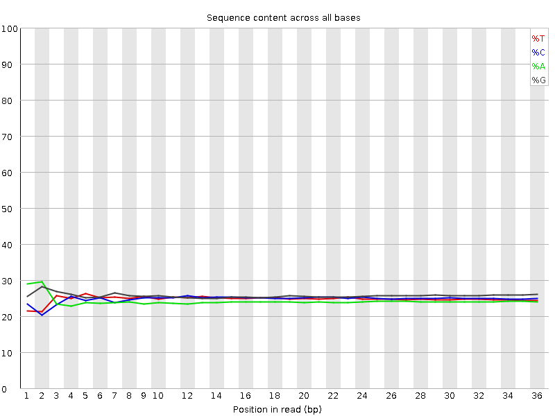 | 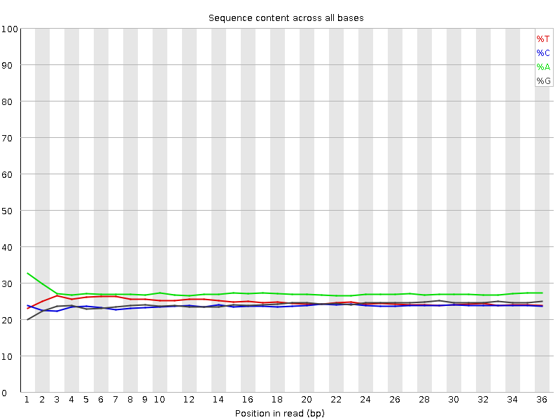
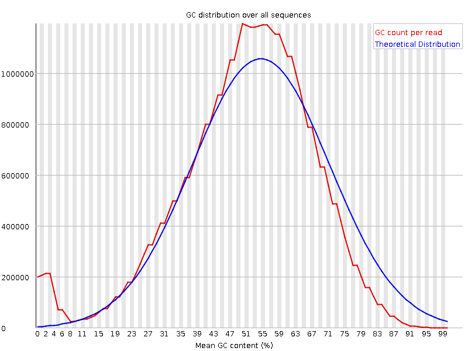 | 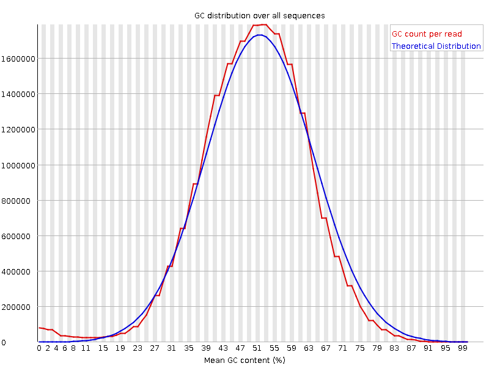 | 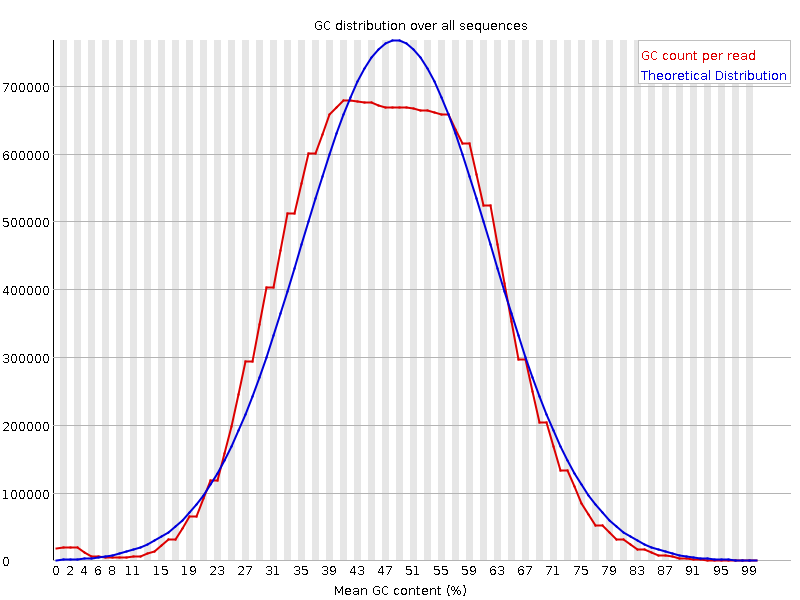
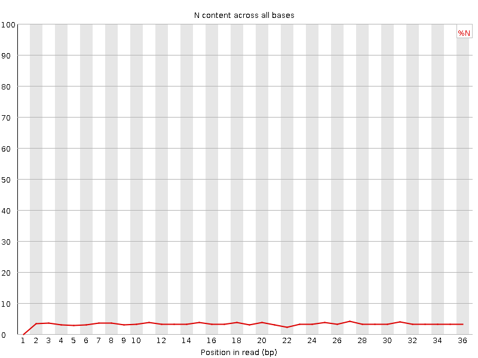 | 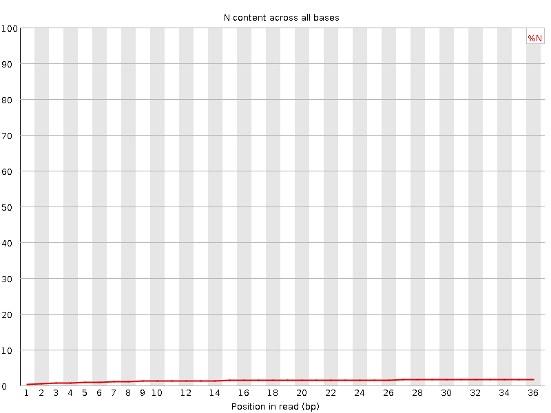 | 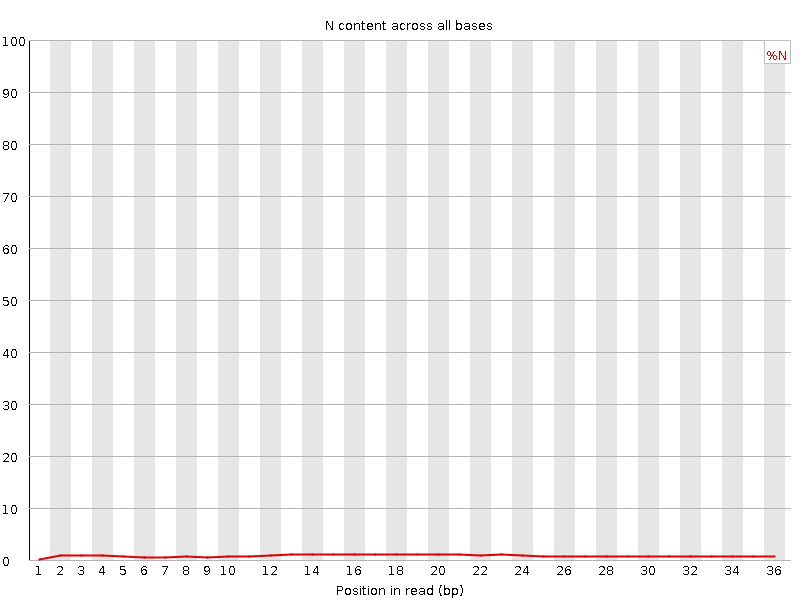

Подрезание не требуется, качество ридов хорошее.

## Таблица со статистикой по выравниванию на 16 хромосому

index | Общее число ридов | Выровнившиеся уникально | (%) | Выровнившиеся неуникально | (%) | Не выровнившиеся | (%)
--- | --- | --- | --- | --- | --- | --- | ---
ENCFF181QBV | 19724714 | 795363 | 4.03% | 2138819 | 10.84% | 16790532 | 85.12%
ENCFF388MXW | 16093701 | 495891 | 3.08% | 785793 | 4.88% | 14812017 | 92.04%
ENCFF176RJQ | 9357767 | 238532 | 2.55% | 831375 | 8.88% | 8287860 | 88.57%

Процент получился достаточно небольшим, так как мы использовали лишь одну хромосому, а это малая часть генома челвоека

## Диаграммы Эйлера-Венна

### Пересечение пиков 1 реплики и ENCODE

В venn1.pdf и venn2.pdf

В результате выравнивания только на одной хромосоме, получено небольшое количество пересечений. Однако, в базе данных ENCODE представлены пики для всех хромосом, и их количество значительно больше. Важно отметить, что пересечение нашего набора пиков с ENCODE и пересечение ENCODE с нашими пиками - это две разные вещи, что объясняет разные значения, полученные в результате исследования.
